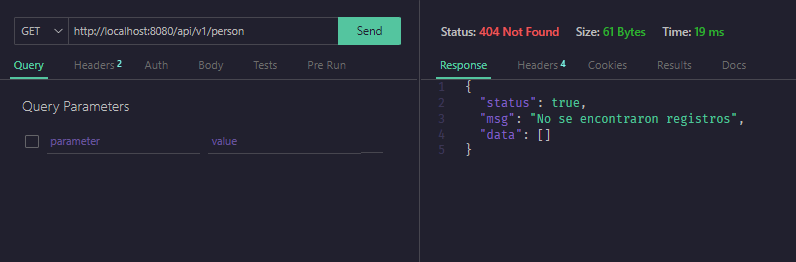
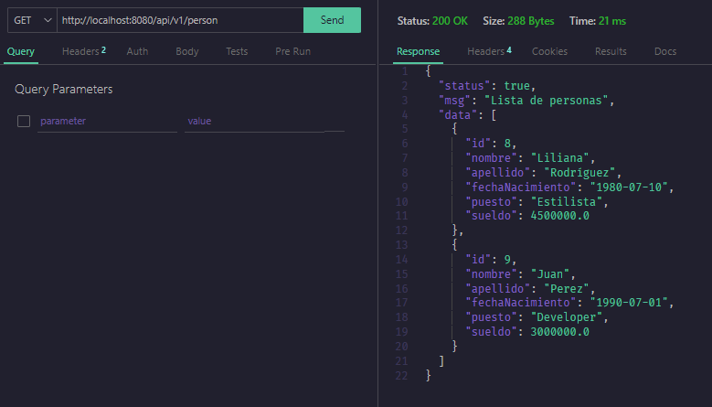
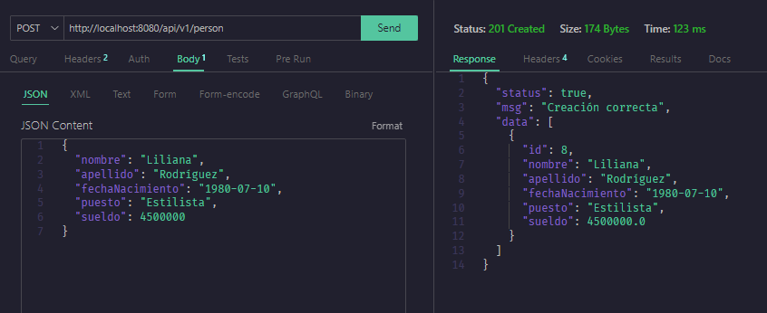
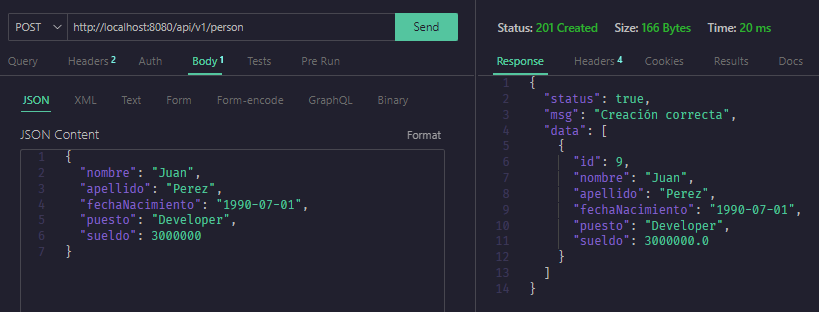
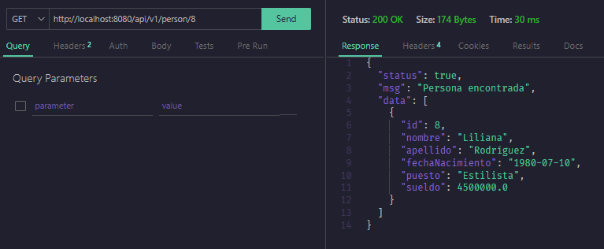
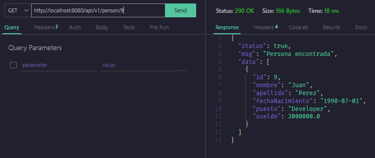
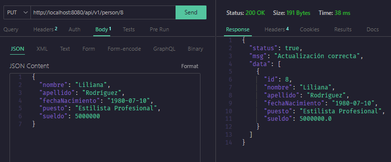
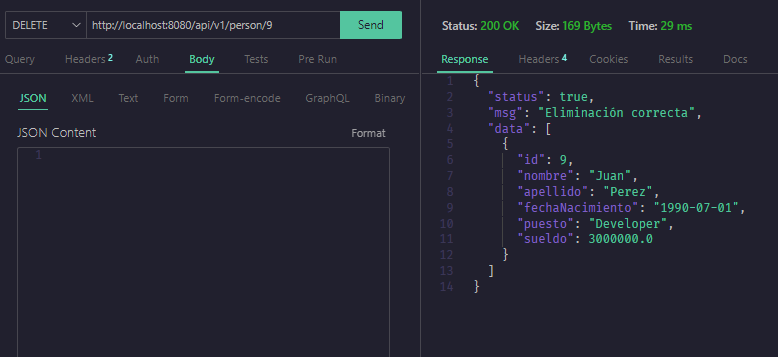

# Proyecto Spring Boot con CRUD Básico - Examen

Este proyecto es una aplicación de ejemplo creada con Spring Boot, Maven y Java 17. La aplicación implementa operaciones CRUD (Crear, Leer, Actualizar, Eliminar) para la entidad `Person`.

## Prerrequisitos

Antes de comenzar, asegúrate de tener instalados los siguientes programas en tu máquina:

1. **Java 20**: Puedes descargarlo e instalarlo desde [OpenJDK](https://jdk.java.net/20/) o tu distribuidor preferido.
2. **Maven**: Puedes descargarlo e instalarlo desde [Apache Maven](https://maven.apache.org/download.cgi).
3. **MySQL**: Puedes descargarlo e instalarlo desde [MySQL](https://dev.mysql.com/downloads/installer/).

## Instalación

Sigue estos pasos para configurar y ejecutar el proyecto en tu entorno local:

1. **Clona el repositorio**:
   
   ```bash
   git clone https://github.com/tonysoft2018/tesffullstack.git
   cd tesffullstack
   git checkout zapata_backend
   cd zapata_backend/zapata_backend
   ```
2. **Configuración de dependencias**:

   ```bash
   mvn clean install
   ```
3. **Configuración de la base de datos**:

   ```bash
   spring.datasource.url=jdbc:mysql://localhost:3306/bd_zapata
   spring.datasource.username=conexion
   spring.datasource.password=123456
   ```
4. **Ejecución del proyecto**:
  ```bash
  mvn spring-boot:run
  ```

5. **Acceso a la aplicación desde postman u otro cliente**:
  ```bash
  http://localhost:8080
  ```

## Endpoints del CRUD

### Crear
```bash
POST http://localhost:8080/api/v1/person

{
    "nombre": "Juan",
    "apellido": "Perez",
    "puesto": "Developer",
    "sueldo": 50000,
    "fecha_nacimiento": "1990-01-01"
}

```
### Leer todas las personas
```bash
GET http://localhost:8080/api/v1/person
```
### Leer una persona
```bash
GET http://localhost:8080/api/v1/person/{personId}
```
### Actualizar
```bash
PUT http://localhost:8080/api/v1/person/{personId}
{
    "nombre": "Juan",
    "apellido": "Perez",
    "puesto": "Senior Developer",
    "sueldo": 60000,
    "fecha_nacimiento": "1990-01-01"
}

```
### Eliminar
```bash
DELETE http://localhost:8080/api/v1/person/{personId}
```

## Capturas de pantalla

### Leer todas las personas



### Crear personas



### Leer una persona



### Actualizar persona


### Eliminar persona

